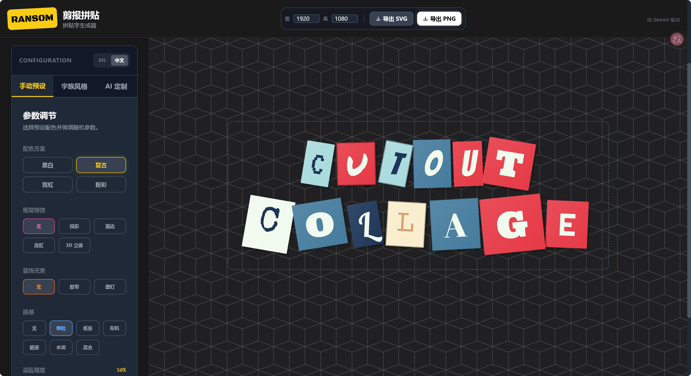

<div align="center">
  
</div>

# Ransom Note Studio

一个面向视频标题、海报文本和风格化字效场景的拼贴字生成工具。它通过“单字随机化”“风格字族”“AI 视觉分析”和“导出工作流”把传统的 ransom note / cutout collage 视觉做成一个可调、可生成、可导出的设计工作台，帮助用户快速做出带有杂志剪报、地下海报、复古朋克和拼贴感的标题画面。

## 产品定位

这个项目解决的不是“排普通文字”，而是“如何快速做出足够有视觉态度的拼贴字设计”。

传统做法往往依赖手工从字体、颜色、纹理、装饰到排版一项项拼出来，过程慢且难以批量尝试。Ransom Note Studio 把这类视觉拆成可控参数：

- 字体差异
- 颜色对撞
- 纹理噪点
- 不规则裁切
- 装饰元素
- 整体混乱度

同时再叠加 AI 风格理解能力，让它不只是一个随机字效玩具，而更像一个面向创作场景的拼贴标题生成器。

## 面向的用户

- 视频创作者：制作封面字、转场标题、章节卡和 MV 文案
- 平面与视觉设计师：快速生成拼贴标题和风格实验稿
- 品牌内容团队：把品牌 / 电影 / 情绪风格转成文字视觉方案
- 创意工具产品团队：验证 AI 驱动的字体拼贴工作台形态

## 核心使用流程

1. 输入一段文本
2. 选择生成方式：
   - 手动预设
   - 风格字族
   - AI 定制
3. 调整混乱度、字体差异、纹理、装饰和视觉特效
4. 预览每个字符的拼贴化结果
5. 重新随机布局或继续微调
6. 导出为 PNG 或 SVG

在 AI 模式下，还可以：

1. 输入品牌 / 电影 / 审美风格提示词
2. 让 AI 生成配色、氛围和风格参数
3. 选择是否让 AI 同时重写文案
4. 基于 AI 结果继续做手动微调

## 当前版本能力

### 1. 单字级拼贴生成

- 每个字符都拥有独立样式
- 支持字体随机化
- 支持旋转、缩放、边框、层级变化
- 支持逐字生成类似剪报拼贴的视觉效果

### 2. 三种创作模式

- 手动预设模式：通过参数直接控制风格
- 风格字族模式：使用预设设计包保持视觉统一
- AI 定制模式：根据提示词自动生成配色与整体氛围

这三种模式适合不同创作阶段：快速试稿、风格定稿和品牌匹配。

### 3. 风格字族系统

当前内置多套字族风格：

- Redacted
- Industrial
- Pop Art
- Blueprint
- Scrapbook
- Acid Rave

每个字族会绑定自己的字体倾向、背景类型、颜色组合、形状逻辑和偏好的装饰 / 特效。

### 4. 视觉效果控制

- 支持黑白、复古、霓虹、粉彩等预设配色方向
- 支持颗粒、纸张、布料、做旧、水泥等纹理模式
- 支持阴影、描边、霓虹、3D 等视觉特效
- 支持胶带、图钉等装饰元素
- 支持整体混乱度和字体差异控制

### 5. AI 风格生成

- 支持通过品牌 / 电影 / 氛围描述生成视觉方案
- AI 会返回调色板、混乱度、字体差异和纹理建议
- 可选由 AI 同时改写文本内容
- 支持服务端代理和客户端 fallback 两种调用方式

### 6. 导出能力

- 支持导出 PNG
- 支持导出 SVG
- 支持自定义导出尺寸
- 适合直接用于视频剪辑、海报设计或后续二次加工

## 产品价值

这个项目的产品价值主要在三个方向：

- 把高风格化标题设计从“手工拼贴”变成“参数化生成”
- 把灵感探索从“慢速排版”变成“快速试稿”
- 把品牌 / 情绪 /流行文化风格转成可视化文本结果

相比普通文字编辑器，它提供的是“视觉性格”；相比纯随机生成器，它提供的是“风格可控性”和“AI 语义驱动”。

## 适用场景

- 视频片头、章节页和字幕标题
- 音乐视频、街头文化、朋克风视觉内容
- 社交媒体封面字和海报标题
- 概念设计和 moodboard 文字实验
- 品牌 campaign 中的高辨识度视觉标题

## 当前技术实现

这是一个前后端结合的轻量创意工具原型，核心实现包括：

- React 19 + TypeScript
- Vite 前端
- 单字级样式生成与渲染
- Gemini 驱动的风格建议与文案生成
- Serverless API 代理 + 前端 fallback
- PNG / SVG 导出流程

当前产品重点是“风格生成与交互控制”，而不是完整的专业排版系统。

## 当前边界与限制

这个版本已经适合作为创意生成工具和产品 demo，但还存在一些明显边界：

- 当前更偏英文和短标题场景，复杂多语言排版仍可继续增强
- 导出结果主要面向视觉稿，不包含完整的专业印刷排版能力
- AI 生成结果依赖提示词质量，风格稳定性会有波动
- 字符拖拽提示目前更偏视觉表达，深度编辑能力还有限
- 尚未提供项目管理、模板库、团队协作和版本历史

## 后续演进方向

- 增加更多字族包和风格模板市场
- 支持更复杂的逐字布局与拖拽编辑
- 增强多语言和长文本排版能力
- 支持动画导出与视频标题模板
- 增加品牌风格锁定和批量生成
- 接入项目保存、历史版本和共享能力

## 本地运行

### 环境要求

- Node.js
- Gemini API Key 或服务端 `API_KEY`

### 启动方式

```bash
npm install
npm run dev
```

### 构建生产包

```bash
npm run build
```

## 仓库结构

```text
Ransom-Note-Studio/
├── App.tsx                    # 主工作台与拼贴生成逻辑
├── components/
│   └── StyleControls.tsx      # 模式切换与参数控制面板
├── services/
│   └── geminiService.ts       # AI 风格生成与 fallback 逻辑
├── api/
│   └── generate.js            # Gemini 服务端代理
├── constants.ts               # 字体、配色、字族和文案配置
├── types.ts                   # 角色样式、配置和 AI 结果类型
└── assets/
    └── readme-banner.png      # README 展示图
```

## 一句话总结

Ransom Note Studio 是一个围绕“高风格化拼贴字”设计的创意工作台：用参数控制视觉混乱度，用字族保持设计统一，用 AI 把风格描述直接转成可导出的标题方案。
